# Awesome Time & Attendance Platforms ⏱️

<div align="center">

<a href="https://github.com/ishandutta2007/Awesome-Awesome-Awesome"></a><a href="https://discord.gg/jc4xtF58Ve"></a>
<a href="https://github.com/ishandutta2007/Awesome-Time-n-Attendance-Platform/stargazers"></a>
<a href="https://github.com/ishandutta2007/Awesome-Time-n-Attendance-Platform/network/members"></a>
<a href="https://github.com/ishandutta2007"></a>

<br/><br/>

<a href="https://github.com/ishandutta2007/Awesome-Time-n-Attendance-Platform">
  
</a>

<br/>

### 🌟 Curated Directory of Enterprise SaaS & Open-Source Time & Attendance Systems

**Empowering workforce management, automated employee timesheets, shift scheduling, geofencing time clocks, biometric punches, leave tracking, and payroll integrations.**

*Last updated: August 2026* 🚀

</div>

---

## 📖 Table of Contents

- [🏢 SaaS & Hosted Platforms](#-saas--hosted-platforms)
- [💻 Open-Source GitHub Projects](#-open-source-github-projects)
- [🧩 Functional Categories for Custom Platforms](#-functional-categories-for-custom-platforms)
- [🏗️ Frameworks & Architecture for Building Custom Platforms](#️-frameworks--architecture-for-building-custom-platforms)
- [📈 Star History](#-star-history)
- [🤝 How to Contribute](#-how-to-contribute)
- [⚖️ Disclaimer](#️-disclaimer)

---

## 🏢 SaaS & Hosted Platforms

A comprehensive, market-sorted directory of leading commercial Time & Attendance and Workforce Management (WFM) platforms. Sorted in descending order by **Company Size / Valuation / Market Cap**.

| Product | Description | Company Size / Valuation | Starting Price | Free Tier / Free Trial Limits |
| :--- | :--- | :--- | :--- | :--- |
| **[Oracle HCM Time & Labor](https://www.oracle.com/human-capital-management/)** 💼 | Enterprise HCM suite with automated time and labor, schedule management, absence rules, compliance controls, and payroll processing. | ~$500B+ Market Cap ($50B+ Rev) | Custom / Starts ~$15.00/employee/month (Requires minimum 1,000 users) | 30-day free trial on Oracle Cloud Infrastructure ($300 credits), no free-forever plan |
| **[SAP SuccessFactors](https://www.sap.com/products/hcm.html)** 🌐 | Global enterprise cloud HCM suite offering employee central time tracking, shift planning, absence management, and workforce compliance. | ~$280B+ Market Cap ($35B+ Rev) | Custom / Starts ~$28.00–$38.00/employee/month | 30-day guided interactive trial / demo environment, no free-forever plan |
| **[QuickBooks Time](https://quickbooks.intuit.com/time-tracking/)** ⏱️ | Cloud time-tracking solution integrated with Intuit QuickBooks for timesheets, GPS location tracking, scheduling, and direct payroll sync. | ~$180B+ Market Cap (Intuit) | $20.00/month base fee + $10.00/user/month (Time Premium) | 30-day free trial (full features, no credit card required), no free-forever plan |
| **[ADP Workforce Now](https://www.adp.com/what-we-offer/products/adp-workforce-now.aspx)** 👔 | All-in-one mid-to-enterprise HCM platform featuring time and attendance automation, punch clocks, scheduling, and automated tax/payroll. | ~$110B+ Market Cap ($19B+ Rev) | Custom / Starts ~$23.00–$30.00/employee/month | Live sandbox demo environment upon sales request, no self-service free tier |
| **[Workday Time Tracking](https://www.workday.com/)** 🏢 | Enterprise cloud application combining time capture across mobile/web/biometrics with global scheduling, project hours, and payroll calculation. | ~$70B+ Market Cap ($8B+ Rev) | Custom / Starts ~$34.00–$50.00/employee/month | Custom enterprise pilot/demo via sales consultation, no free-forever plan |
| **[Paychex Flex](https://www.paychex.com/payroll/paychex-flex)** 📊 | Unified payroll, HR, and workforce-management system with digital time clocks, geolocation attendance, shift scheduling, and PTO tracking. | ~$48B+ Market Cap ($5.4B+ Rev) | Custom / Starts ~$39.00/month base fee + $5.00/user/month | Interactive guided software test demo, no self-service free tier |
| **[Rippling](https://www.rippling.com/)** ⚡ | Modern unified workforce platform that natively connects employee time tracking, approvals, hourly scheduling, IT devices, and payroll. | $13.5B Valuation | $35.00/month base fee + $8.00/employee/month | Custom interactive product walkthrough demo, no free-forever plan |
| **[Ceridian Dayforce](https://www.dayforce.com/)** 🕒 | Real-time enterprise HCM and workforce platform with continuous pay calculation, time and attendance, complex scheduling, and labor compliance. | ~$10.5B Market Cap ($1.6B+ Rev) | Custom / Starts ~$22.00–$31.00/employee/month | Sales-led customized sandbox demo, no self-service free tier |
| **[Paylocity](https://www.paylocity.com/)** 📱 | Cloud-based HR and payroll solution offering mobile time clocks, geofencing, shift scheduling, kiosk kiosks, and automated timesheets. | ~$10.2B Market Cap ($1.4B+ Rev) | Custom / Starts ~$22.00–$32.00/employee/month | Personalized product demonstration on request, no free-forever plan |
| **[Gusto](https://gusto.com/)** 💸 | Modern payroll, benefits, and HR platform for SMBs with built-in time tracking, PTO requests, geofencing mobile clock-ins, and project hours. | $10.0B Valuation | $49.00/month base fee + $6.00/person/month (Plus plan required for full time-tracking features) | 30-day free trial on selected payroll/time tiers, no free-forever plan |
| **[UKG Pro Workforce Management](https://www.ukg.com/products/ukg-pro-workforce-management)** 🛡️ | Enterprise workforce-management platform with AI-driven scheduling, labor-cost forecasting, time tracking, and global attendance policies. | ~$6.5B Valuation (UKG ~$4B Rev) | Custom / Starts ~$25.00–$40.00/employee/month | Sales-led enterprise virtual demo, no self-service free tier |
| **[UKG Ready](https://www.ukg.com/products/ukg-ready)** 🔄 | Unified HR, payroll, talent, time, attendance, and shift scheduling platform engineered specifically for mid-market organizations. | ~$6.5B Valuation (UKG ~$4B Rev) | Custom / Starts ~$12.00–$18.00/employee/month | Sales-assisted guided demo, no self-service free-forever tier |
| **[Paycor](https://www.paycor.com/)** 🧑‍💼 | Comprehensive HCM and payroll software with automated employee time card management, punch approvals, mobile scheduling, and PTO tracking. | ~$3.2B Market Cap ($650M+ Rev) | Custom / Starts ~$19.00–$27.00/employee/month | Custom guided product demo upon request, no free-forever plan |
| **[Deltek Replicon](https://www.replicon.com/)** ⏱️ | Cloud time intelligence platform providing global time and attendance, project time tracking, labor compliance, and client billing automation. | ~$3.0B Valuation (Deltek) | Starts ~$6.00/user/month (Time & Attendance modular tier) | 14-day free trial (full access to selected module features), no free-forever tier |
| **[Factorial](https://factorialhr.com/)** 📑 | All-in-one HR, shift management, and time-tracking suite with QR code/facial clock-ins, leave approvals, and legal compliance. | $1.0B Valuation | Starts $8.00/user/month (Billed annually; minimum user counts apply) | 14-day free trial (all features unlocked, no credit card required), no free-forever tier |
| **[Zoho People](https://www.zoho.com/people/)** 👥 | Cloud HRMS and attendance software supporting biometric integration, IP restrictions, shift rotation, timesheets, and leave policies. | ~$1.0B+ ARR (Zoho Corp) | Starts $1.25/user/month (Essential HR) or $2.00/user/month (Professional with Timesheets) | Free-forever plan for up to 5 users (basic HR and attendance records) |
| **[BambooHR](https://www.bamboohr.com/)** 🎋 | Intuitive HR platform with integrated time tracking, timesheets, PTO management, geofenced mobile clocking, and payroll reporting. | ~$1.0B+ Valuation (~$150M+ ARR) | Custom / Starts ~$10.00/employee/month + $3.00/user/month for Time Tracking add-on | 7-day free trial (full platform access), no free-forever plan |
| **[Deputy](https://www.deputy.com/)** 📋 | Smart employee scheduling and time-tracking platform with facial recognition clock-ins, meal break compliance, and labor law alerts. | ~$1.0B Valuation (~$100M+ ARR) | Starts $4.50/user/month (Time & Attendance plan) or $6.00/user/month (Premium) | 31-day free trial (unlimited users and full features), no free-forever tier |
| **[Connecteam](https://connecteam.com/)** 📲 | Frontline and deskless workforce platform featuring GPS/geofence punch clocks, shift scheduling, automated timesheets, and chat. | ~$500M+ Valuation | Starts $29.00/month flat rate (covers first 30 users, +$0.50/user thereafter) | Free-forever "Small Business Plan" for up to 10 users with full standard features |
| **[Homebase](https://joinhomebase.com/)** 🏠 | Hourly workforce management app combining time clocks, shift scheduling, hiring, compliance, and messaging for local businesses. | ~$500M Valuation | Free plan available; Paid tiers start at $24.95/month per location (Unlimited employees) | Free-forever plan for 1 location and up to 20 employees (basic time tracking and scheduling) |
| **[When I Work](https://wheniwork.com/)** 📅 | Shift-based employee scheduling and attendance platform with mobile time clocking, GPS verification, and timesheet approvals. | ~$300M+ Valuation | Starts $2.50/user/month (Standard Scheduling) or $4.00/user/month (with Time & Attendance) | 14-day free trial (full features, up to 75 users), no free-forever plan |
| **[TCP Software (TimeClock Plus)](https://www.timeclockplus.com/)** ⏰ | Enterprise time and attendance software with specialized hardware time clocks, dynamic workforce scheduling, and leave management. | ~$100M+ ARR (Private Equity Backed) | Custom / Starts ~$5.00–$8.00/user/month based on deployment tier | Customized interactive software demo upon request, no free-forever plan |
| **[CAKE.com Clockify](https://clockify.me/)** ⌛ | Widely used time-tracking and timesheet software with productivity monitoring, project tracking, kiosk clock-ins, and leave management. | ~$50M+ ARR (CAKE.com) | Starts $3.99/user/month (Basic, billed annually) or $4.99/user/month (monthly) | Free-forever plan for up to 5 users (unlimited time tracking, projects, and basic reporting) |
| **[Hubstaff](https://hubstaff.com/)** 🛰️ | Workforce time tracking and productivity platform with GPS location tracking, automatic geofenced clock-in, timesheets, and invoicing. | ~$30M+ ARR | Starts $4.99/user/month (Starter, billed annually; minimum 2 seats) | Free-forever plan for 1 user (solo freelancer limit with basic time tracking) |
| **[Harvest](https://www.getharvest.com/)** 🌾 | Time tracking and expense management software for teams, featuring project budgets, visual timesheets, invoicing, and integrations. | ~$25M+ ARR | Starts $10.80/seat/month (billed annually) or $12.00/seat/month (monthly) | Free-forever plan for 1 user and up to 2 active projects; 30-day free trial for Pro |
| **[Scoro](https://www.scoro.com/)** 📊 | Comprehensive work and resource management platform with built-in time tracking, billable timesheets, project budgets, and capacity planning. | ~$20M+ ARR | Starts $26.00/user/month (Core/Essential, billed annually; minimum 5 users) | 14-day free trial (full features unlocked, no credit card required), no free-forever tier |
| **[Toggl Track](https://toggl.com/track/)** ⏱️ | Fast, flexible time tracker with automated reminders, timesheet auditing, calendar integration, and billable hours management. | ~$20M+ ARR | Starts $9.00/user/month (Starter, billed annually) or $10.00/user/month (monthly) | Free-forever plan for up to 5 users (basic time tracking, reporting, and export tools) |
| **[Timely](https://timelyapp.com/)** 🤖 | AI-powered automatic time-tracking platform that records application time in the background, generates timesheets, and tracks project budgets. | ~$10M+ ARR | Starts $9.00/user/month (Starter, billed annually; minimum seats apply) | 14-day free trial (full feature suite with Memory app tracker), no free-forever tier |
| **[Jibble](https://www.jibble.io/)** 🤳 | Cloud time clock app with facial recognition, GPS geofencing, mobile attendance, automated timesheets, and overtime calculation. | ~$10M+ ARR | Starts $3.99/user/month (Premium, billed annually) or $4.99/user/month (monthly) | Free-forever plan for unlimited users (includes GPS, facial recognition, and basic timesheets) |
| **[Buddy Punch](https://buddypunch.com/)** 🥊 | Online punch clock and timesheet app with facial recognition, GPS geofencing, QR code punches, PTO accruals, and scheduling. | ~$5M+ ARR | $19.00/month base fee + $4.99/user/month (Standard plan, billed annually) | 14-day free trial (all features unlocked, no credit card required), no free-forever tier |
| **[Everhour](https://everhour.com/)** ⏱️ | Project-oriented time tracker seamlessly embedding inside Asana, Trello, Jira, and ClickUp with timesheets, budgeting, and payroll export. | ~$5M+ ARR | Starts $8.50/user/month (Team plan, billed annually; minimum 2 seats) | Free-forever plan for up to 5 users (lightweight tracking without deep third-party integrations) |
| **[TimeCamp](https://www.timecamp.com/)** 🏕️ | Automatic background time tracker with project profitability, attendance tracking, computer activity monitoring, and timesheet approvals. | ~$5M+ ARR | Starts $3.99/user/month (Starter, billed annually) or $5.49/user/month (monthly) | Free-forever plan for unlimited users (basic time tracking and project hierarchy) |
| **[Paymo](https://www.paymoapp.com/)** 💳 | Work management software combining time tracking, employee timesheets, task scheduling, Gantt charts, and client invoicing. | ~$3M+ ARR | Starts $5.90/user/month (Starter, billed annually; limited to 1 user) or $10.90/user/month (Small Team) | Free-forever plan for 1 user (up to 3 clients, 50 tasks, and basic time tracking) |

---

## 💻 Open-Source GitHub Projects

Explore the top open-source time-tracking, attendance-recording, timesheet-auditing, and human-resource-management systems. Sorted in descending order by **GitHub Star Count** (each badge links to the repository stargazers page).

| Project & Repo Link | Star Count | Language / Stack | License | Key Features & Focus |
| :--- | :--- | :--- | :--- | :--- |
| **[ERPNext](https://github.com/frappe/erpnext)** | [](https://github.com/frappe/erpnext/stargazers) | Python, JavaScript | GPL-3.0 | Complete open-source ERP suite containing employee databases, attendance logs, shift assignment, timesheets, payroll, and leave management. |
| **[Nextcloud Server](https://github.com/nextcloud/server)** | [](https://github.com/nextcloud/server/stargazers) | PHP, JavaScript | AGPL-3.0 | Self-hosted collaboration cloud ecosystem extendable with community Time Tracking, Appointments, Calendar, and Form apps. |
| **[ActivityWatch](https://github.com/ActivityWatch/activitywatch)** | [](https://github.com/ActivityWatch/activitywatch/stargazers) | Python, Rust, Vue | MPL-2.0 | Privacy-first automated time and activity tracker recording active window titles, applications, and browser usage locally. |
| **[OpenProject](https://github.com/opf/openproject)** | [](https://github.com/opf/openproject/stargazers) | Ruby on Rails, Angular | GPL-3.0 | Project and work management system with integrated employee time logging, cost reporting, resource allocation, and budget tracking. |
| **[Frappe Framework](https://github.com/frappe/frappe)** | [](https://github.com/frappe/frappe/stargazers) | Python, JavaScript | MIT | Full-stack web framework underlying Frappe HR and ERPNext, ideal for building custom attendance, biometric, and payroll systems. |
| **[Kanboard](https://github.com/kanboard/kanboard)** | [](https://github.com/kanboard/kanboard/stargazers) | PHP | MIT | Minimalist Kanban project management tool with subtask time tracking, estimated vs. spent time analysis, and user timesheets. |
| **[solidtime](https://github.com/solidtime-io/solidtime)** | [](https://github.com/solidtime-io/solidtime/stargazers) | PHP (Laravel), Vue.js | AGPL-3.0 | Modern, open-source time-tracking platform designed for freelancers and teams with project billing, organization hierarchies, and API. |
| **[Frappe HR (HRMS)](https://github.com/frappe/hrms)** | [](https://github.com/frappe/hrms/stargazers) | Python, Vue, JS | GPL-3.0 | Modern open-source HRMS application with check-in/out attendance logs, shift scheduling, leave allocation, expense claims, and payroll. |
| **[Dolibarr ERP/CRM](https://github.com/Dolibarr/dolibarr)** | [](https://github.com/Dolibarr/dolibarr/stargazers) | PHP, JavaScript | GPL-3.0 | Modular ERP/CRM with HR modules for employee attendance tracking, timesheets, leave requests, expense reports, and salary records. |
| **[Redmine](https://github.com/redmine/redmine)** | [](https://github.com/redmine/redmine/stargazers) | Ruby on Rails | GPL-2.0 | Flexible project management and issue tracker with spent-time logging, activity categorization, custom queries, and reporting. |
| **[Kimai](https://github.com/kimai/kimai)** | [](https://github.com/kimai/kimai/stargazers) | PHP (Symfony), Twig | AGPL-3.0 | Feature-packed open-source time tracker with punch clock, timesheets, multi-timezone support, invoicing, granular permissions, and REST API. |
| **[Ever Gauzy](https://github.com/ever-co/gauzy)** | [](https://github.com/ever-co/gauzy/stargazers) | TypeScript (NestJS, Angular) | AGPL-3.0 | Open-source enterprise ERP, HRM, and time-tracking platform with desktop employee activity tracking, screenshots, and payroll tools. |
| **[Worklenz](https://github.com/Worklenz/worklenz)** | [](https://github.com/Worklenz/worklenz/stargazers) | TypeScript, Node.js, Angular | AGPL-3.0 | Project and workforce management platform featuring real-time task time tracking, resource allocation, timesheets, and productivity graphs. |
| **[TimeTagger](https://github.com/almarklein/timetagger)** | [](https://github.com/almarklein/timetagger/stargazers) | Python, JavaScript | GPL-3.0 | Interactive, tag-powered open-source time tracker with an intuitive timeline UI, reporting dashboards, and self-hosted backend. |
| **[Traggo Server](https://github.com/traggo/server)** | [](https://github.com/traggo/server/stargazers) | Go, TypeScript, React | GPL-3.0 | Self-hosted, tag-based time tracking server with customizable properties, GraphQL API, multi-user support, and web UI. |
| **[Timeoff Management](https://github.com/timeoff-management/application)** | [](https://github.com/timeoff-management/application/stargazers) | JavaScript (Node.js, Express) | MIT | Open-source absence, leave, and PTO management system with approval workflows, department calendars, and holiday sync. |
| **[eHour](https://github.com/te-con/ehour)** | [](https://github.com/te-con/ehour/stargazers) | Java, React | AGPL-3.0 / BSD | Proven open-source web-based time tracking system for consulting firms and companies with project timesheets and exportable reports. |
| **[Cattr](https://github.com/cattr-app/cattr-backend)** | [](https://github.com/cattr-app/cattr-backend/stargazers) | PHP (Laravel), Vue.js | AGPL-3.0 | Open-source team time tracking platform with companion desktop client, activity monitoring, screenshot capture, and detailed task reports. |
| **[openTimetool](https://github.com/solidar-it/openTimetool)** | [](https://github.com/solidar-it/openTimetool/stargazers) | PHP, JavaScript | GPL-3.0 | Self-hosted time recording application for tracking work packages, project budgets, and employee attendance logs. |

---

## 🧩 Functional Categories for Custom Platforms

Building a bespoke, self-hosted workforce-management solution requires assembling multiple open-source building blocks:

- ⏱️ **Open-Source Time Trackers:** For punch-in/out, start-stop timers, timesheets, and exportable project hours (*Kimai, solidtime, Cattr, TimeTagger, Traggo*).
- 📍 **Open-Source Attendance & Geofencing Systems:** For location-aware clocking, mobile QR verification, and punch log audit trails.
- 🏢 **Open-Source HRMS & ERP Platforms:** For centralized employee records, department structures, leave management, and company policy enforcement (*Frappe HR, ERPNext, Dolibarr, Ever Gauzy*).
- 📅 **Open-Source Scheduling Engines:** For shift planning, rotation management, employee availability, and shift swapping.
- 💳 **Open-Source Payroll Processing Connectors:** For transforming approved attendance hours, overtime rules, and leave deductions into payroll journal entries.
- 📊 **Open-Source Workforce Analytics & BI:** For tracking labor costs, utilization rates, absenteeism trends, and overtime monitoring (*Metabase, Grafana, Apache Superset*).
- 🔒 **Open-Source Identity & Access Management (IAM):** For SSO, biometric device authentication, and RBAC (*Keycloak, Authentik, Zitadel*).

---

## 🏗️ Frameworks & Architecture for Building Custom Platforms

```
┌─────────────────────────────────────────────────────────────────────────┐
│                     FRONTEND / CLOCK-IN INTERFACES                      │
│   Web Time Clock  •  Mobile GPS Check-in  •  Biometric / Kiosk Device   │
└────────────────────────────────────┬────────────────────────────────────┘
                                     │ (REST / GraphQL / WebSocket)
┌────────────────────────────────────▼────────────────────────────────────┐
│                    CORE TIME & ATTENDANCE ENGINE                        │
│          Kimai  /  solidtime  /  Frappe HR  /  Ever Gauzy               │
│  ┌────────────────────────┐  ┌────────────────────────────────────────┐ │
│  │ Timesheets & Punches   │  │ Shifts, Breaks & Leave Rules           │ │
│  └────────────────────────┘  └────────────────────────────────────────┘ │
└────────────────────────────────────┬────────────────────────────────────┘
                                     │ (Webhooks / Celery / Event Bus)
┌────────────────────────────────────▼────────────────────────────────────┐
│                    PAYROLL & ANALYTICS INTEGRATION                      │
│   ERPNext Payroll  •  PostgreSQL Database  •  Grafana / Metabase BI     │
└─────────────────────────────────────────────────────────────────────────┘
```

**Recommended Custom Stack Blueprint:**
1. **Time Capture Layer:** Deploy **[Kimai](https://github.com/kimai/kimai)** or **[solidtime](https://github.com/solidtime-io/solidtime)** for web, mobile, and API-driven punch clocks.
2. **Workforce & HR Layer:** Deploy **[Frappe HR](https://github.com/frappe/hrms)** on **[Frappe Framework](https://github.com/frappe/frappe)** for shift management, leave approvals, holiday calendars, and salary structures.
3. **Project & Task Layer:** Connect **[OpenProject](https://github.com/opf/openproject)** or **[Worklenz](https://github.com/Worklenz/worklenz)** for project timesheets and resource planning.
4. **Analytics & BI Layer:** Stream attendance records into **PostgreSQL** visualized via **Grafana** or **Metabase** dashboards for real-time labor cost tracking.

---

## 📈 Star History

[](https://star-history.dera.page/#ishandutta2007/Awesome-Time-n-Attendance-Platform&type=date&legend=top-left)

---

## 🤝 How to Contribute

1. 🍴 Fork this repository.
2. 📝 Add or edit entries in `README.md` following the tabular schema.
3. 🔍 Provide exact starting prices, free tier / trial limits, and official links for SaaS products.
4. ⭐ For open-source tools, include the repository URL, star badge linking to `/stargazers`, stack, and license.
5. 🚀 Submit a Pull Request with a concise summary of changes.

---

## ⚖️ Disclaimer

- This repository is a **community-curated index** for informational purposes.
- Time and attendance systems often handle sensitive employee location data and biometric information; ensure adherence to local labor laws, GDPR, and privacy regulations.
- Commercial SaaS pricing, free tier terms, and feature sets change frequently; verify directly on each vendor's website.
- Verify open-source software licenses before deployment in commercial or self-hosted environments.

---

<div align="center">

**Maintained with ❤️ for HR teams, workforce managers, developers, and operations leaders.**

</div>
